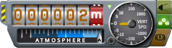

Radar Altitude for KSP
========

KSP's exterior view shows altitude above sea level ("ASL") at the top of the screen (actually altitude above the deepest point for planets without seas). That's not very useful when you're attempting to land in the dark or trying to conserve fuel by starting your landing burn as late as possible. What you want to see instead is altitude above ground level ("AGL").

Manned command modules are equipped with an RDA-1 radar altimeter which displays AGL for altitudes < 3000m, with more precision for altitudes < 500m. But you have to switch to internal view to see it which is a pain for manned modules and isn't possible at all for unmanned probes:

This mod automatically switches the  exterior view's altitude readout from ASL to AGL and the digits' colour from black to "navball brown" when your gear is down and your altitude is below 3000m AGL:

Note that, like the RDA-1 altimeter, the display shows the altitude of the _command module_ above the ground so when judging your landing you still have to account for the height of fuel tanks, landing legs etc below your command module.

Installation
--------
* Download and extract the [latest release](https://github.com/Marginal/RadarAltitude/releases/latest).
* Put the "RadarAltitude" folder in your KSP installation's "GameData" folder.

Acknowledgements
--------
* Joe Patrick's [Radar Altimeter](https://github.com/JoePatrick1/KSPradaralt) for 1.2 which performed a similar function, but which required a hotkey press to switch between ASL and AGL.

License
-------
Copyright © 2018 Jonathan Harris.

Licensed under the [GNU Public License (GPL)](http://www.gnu.org/licenses/gpl-2.0.html) version 2 or later.
